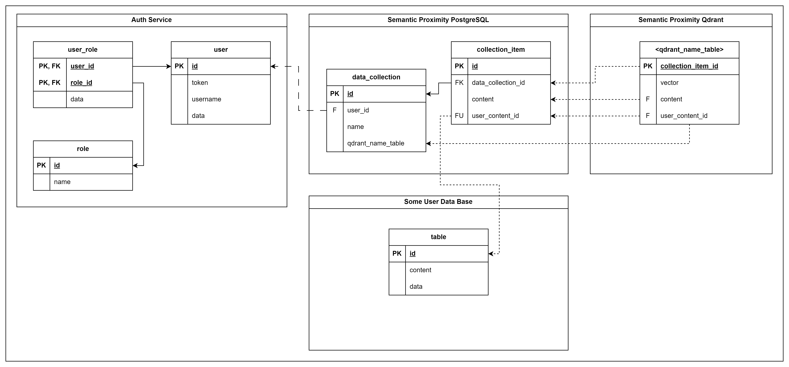

# Проект: разработка сервиса определения семантической близости

## О сервисе
### Цели / Задачи проекта
* Разработка инструмента для определения семантической близости на основе современных методов NLP.
* Создание удобного и эффективного интерфейса для использования сервиса.
* Обеспечение высокой точности определения семантической близости между текстовыми элементами.
* Предоставление возможности интеграции сервиса в другие приложения и системы для улучшения их функциональности.

### Описание сервиса
_Сервис определения семантической близости будет способен анализировать сходство между словами, 
фразами или документами на основе их значений и контекста.
Он будет использовать методы обработки естественного языка (Natural Language Processing, NLP) 
для определения степени семантической близости между различными текстовыми элементами.
Пользователи смогут получать информацию о том, насколько похожи или отличаются между собой 
различные текстовые фрагменты, что может быть полезно, например, для поиска похожих документов, 
кластеризации информации или создания рекомендательных систем._

### Приблизительный план реализации
1. __Исследование и выбор методов NLP:__ Изучение существующих методов определения семантической близости и выбор наиболее подходящих для конкретной задачи.
2. __Сбор и подготовка данных:__ Получение и подготовка большого объема текстовых данных для обучения модели.
3. __Обучение модели:__ Разработка и обучение модели, способной определять семантическую близость на основе выбранных методов.
4. __Разработка API:__ Создание программного интерфейса, позволяющего взаимодействовать с моделью через стандартные HTTP-запросы.
5. __Тестирование и оптимизация:__ Проверка работы модели на тестовых данных, выявление и исправление ошибок, оптимизация производительности.
6. __Развёртывание и масштабирование:__ Запуск сервиса на сервере, готовность к обработке запросов от множества пользователей.
### 

## Предложения по схеме базы данных



## Предложения по REST API интерфейсу (endpoints)
Общий Endpoint сервиса: `/api/v0/sps`

Header:
* Content-Type: `application/json`
* Token: `<Token>`

### REST API Semantic Proximity Service
Endpoints:
* `/api/v0/sps`
* `/api/v0/sps/find`
* `/api/v0/sps/collection`
* `/api/v0/sps/collection/{id}`
* `/api/v0/sps/collection/{id}/find`
* `/api/v0/sps/collection/items`
* `/api/v0/sps/collection/{data_collection_id}/items`
* `/api/v0/sps/collection/{data_collection_id}/items/{id}`
* `/api/v0/sps/collection/{data_collection_id}/items/{id}/find`
* `/api/v0/sps/collection/{data_collection_id}/items/content/{user_content_id}`
* `/api/v0/sps/collection/{data_collection_id}/items/content/{user_content_id}/find`
##### Одноразово определяет семантическую близость между словом и списком слов
__Request__<br>
Header:
* Method: `GET`
* URL: `/find`

Body:
```json
{
  "content": "str",
  "user_content_id": "str",
  "compared_items": [
    {
      "content": "str",
      "user_content_id": "str"
    }
  ]
}
```
__Response__<br>
Body:
```json
{
  "content": "str",
  "user_content_id": "str",
  "compared_items_result": [
    {
      "content": "str",
      "user_content_id": "str",
      "semantic_proximity": 0.0
    }
  ]
}
```

#### Data Collection `/collections`
##### Создать коллекцию
__Request__<br>
Header:
* Method: `POST`
* URL: `/`

Body:
```json
{
  "name": "str"
}
```
__Response__<br>
Body:
```json
{
  "id": 0,
  "name": "str"
}
```
##### Получить список коллекций пользователя
__Request__<br>
Header:
* Method: `GET`
* URL: `/`

Body:
```json
null
```
__Response__<br>
Body:
```json
[
  {
    "id": 0,
    "name": "str"
  }
]
```
##### Получить коллекцию по id
__Request__<br>
Header:
* Method: `GET`
* URL: `/{id}`

Body:
```json
null
```
__Response__<br>
Body:
```json
{
  "id": 0,
  "name": "str"
}
```
##### Редактировать коллекцию по id
__Request__<br>
Header:
* Method: `PUT`
* URL: `/{id}`

Body:
```json
{
  "name": "str"
}
```
__Response__<br>
Body:
```json
{
  "id": 0,
  "name": "str"
}
```
##### Удалить коллекцию по id
__Request__<br>
Header:
* Method: `DELETE`
* URL: `/{id}`

Body:
```json
null
```
__Response__<br>
Body:
```json
{
  "id": 0,
  "name": "str"
}
```

#### Collection Item `/collections`
##### Создать элемент коллекции
__Request__<br>
Header:
* Method: `POST`
* URL: `/{data_collection_id}/items`

Body:
```json
{
  "content": "str",
  "user_content_id": "id"
}
```
__Response__<br>
Body:
```json
{
  "id": 0,
  "data_collection_id": 0,
  "content": "str",
  "user_content_id": "id"
}
```
##### Получить список элементов коллекции пользователя
__Request__<br>
Header:
* Method: `GET`
* URL: `/{data_collection_id}/items?offset={offset}&limit={limit}`

Body:
```json
null
```
__Response__<br>
Body:

```json
{
  "result": [
    {
      "id": 0,
      "data_collection_id": 0,
      "content": "str",
      "user_content_id": "str"
    }
  ],
  "offset": 0,
  "limit": 0,
  "total": 0
}
```
##### Получить элемент коллекции по id или user_content_id
__Request__<br>
Header:
* Method: `GET`
* URL: `/{data_collection_id}/items/{id}` | `/{data_collection_id}/items/content/{user_content_id}`

Body:
```json
null
```
__Response__<br>
Body:
```json
{
  "id": 0,
  "data_collection_id": 0,
  "content": "str",
  "user_content_id": "id"
}
```
##### Редактировать элемент коллекции по id или user_content_id
__Request__<br>
Header:
* Method: `PUT`
* URL: `/{data_collection_id}/items/{id}` | `/{data_collection_id}/items/content/{user_content_id}`

Body:
```json
{
  "content": "str",
  "user_content_id": "id"
}
```
__Response__<br>
Body:
```json
{
  "id": 0,
  "data_collection_id": 0,
  "content": "str",
  "user_content_id": "id"
}
```
##### Удалить элемент коллекции по id
__Request__<br>
Header:
* Method: `DELETE`
* URL: `/{data_collection_id}/items/{id}`

Body:
```json
null
```
__Response__<br>
Body:
```json
{
  "id": 0,
  "data_collection_id": 0,
  "content": "str",
  "user_content_id": "id"
}
```
##### Поиск по параметрам и семантической близости элементов коллекции
__Request__<br>
Header:
* Method: `GET`
* URL: `/{data_collection_id}/find?save=false&count={count}&limit_accuracy={limit_accuracy}`

Body:
```json
{
  "content": "str",
  "user_content_id": "str"
}
```
__Response__<br>
Body:
```json
{
  "content": "str",
  "user_content_id": "str",
  "compared_items_result": [
    {
      "content": "str",
      "user_content_id": "str",
      "semantic_proximity": 0.0
    }
  ]
}
```
##### Поиск по параметрам и семантической близости элементов коллекции по id или user_content_id
__Request__<br>
Header:
* Method: `GET`
* URL: `/{data_collection_id}/items/{id}/find` | `/{data_collection_id}/items/content/{user_content_id}/find` + `?count={count}&limit_accuracy={limit_accuracy}`

Body:
```json
null
```
__Response__<br>
Body:
```json
{
  "content": "str",
  "user_content_id": "str",
  "compared_items_result": [
    {
      "content": "str",
      "user_content_id": "str",
      "semantic_proximity": 0.0
    }
  ]
}
```
